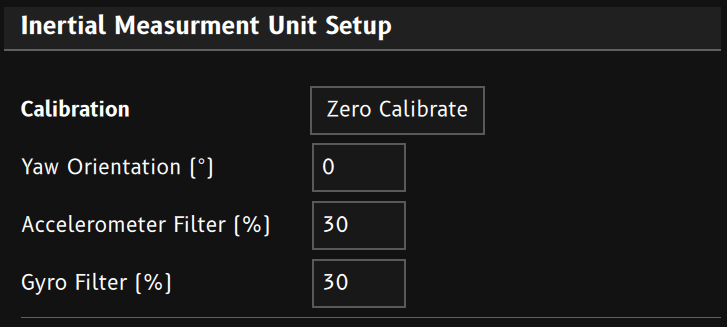

Emtron ED Series Displays contain 6 axis Inertial Measurement Unit (IMU).

## Output Channels
 - G-Force Lateral
 - G-Force Longitude
 - G-Force Vertical
 - Acceleration Lateral
 - Acceleration Longitude
 - Acceleration Vertical
 - Angular Velocity X
 - Angular Velocity Y
 - Angular Velocity Z
 - Roll
 - Pitch
 - Yaw

## Calibration

1. Make sure car is parked on a flat level surface. 
2. Click `Zero Calibrate` to put the IMU into calibration mode. The device will take 5 seconds worth of samples and find it's vertical orientation. The calibration is stored in permanent memory in the device.
3. Once completed, `G-Force Vertical` should read close to 1.0G, while `G-Force Lateral` and `G-Force Longitude` should be 0.0G.
4. Drive the car forward and stop. `G-Force Longitude` should go positive when accelerating and negative when braking. `G-Force Lateral` should remain near zero.
5. If required, adjust the `Yaw Orientation` value until the Longitudinal and Lateral G-Forces are aligned correctly.

> **In Field Calibration:** Conditional Logic can be used to generate the `IMU Calibration Begin` event. This allows the IMU to be calibrated from a keypad button or similar user input.

## Filtering
`Accelerometer Filter` and `Gyro Filter` values control how filtered the IMU measurements are.Values are a percentage (0 - 99.9%). Higher filtering gives a cleaner signal, but slows down the signals rate of change. Use the least filtering you can get away with. 
*Typical values would be 10-40 %*