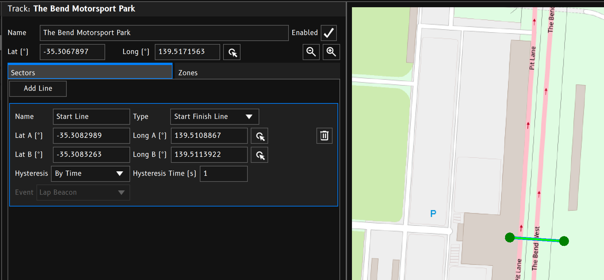
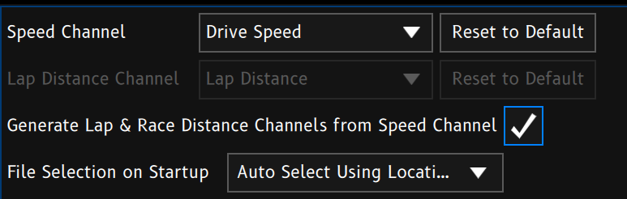

The Lap Timing function outputs lap and timing data based triggered by lap beacon events.

## Input Channels
 - **Speed Channel:** Select the channel to use as the speed input.
 - **Lap Distance Channel:** *Optional* - Select the channel to use as the lap distance input.
 > **Note:** Lap and Race distance can be calculated from the speed input channel.

 ## Input Events
 Three main events are used to control the lap timing function.
 These events can be triggered however you see fit. Typically they're triggered by GPS position as configured in [Track Setup](./track-setup.md).

### Lap Beacon
 - Triggers the start of a new lap. 
 - Triggers the update of Best Lap, Previous Lap, and Time Delta related channels.

### Sector Beacon
 - Triggers the start of a new sector within the current lap.

### Finish Beacon
 - Triggers the end of the current lap and sector. The Lap Timing system will wait for a new race to start.

## Input Channels

### Speed Channel
The selected speed channel is used to record speed data during the lap.

### Lap Distance Channel
When `Generate Lap & Race Distance Channels from Speed Channel` is *CHECKED*, the `Lap Distance` and `Race Distance` channels hold values automatically calculated from the Speed Channel.

When `Generate Lap & Race Distance Channels from Speed Channel` is *UNCHECKED*, the selected Lap Distance channel is read and the data is stored in the current lap data.

### Lap Count
If the `Lap Count` channel is generated and holds a non zero value, it is used to trigger the end of a race.

## Finishing a Race
### End on Lap Count
When the [Lap Beacon](#lap-beacon) event is triggered, and the `Lap` channel value equals the `Lap Count` channel value, the Current Lap (and sector) is ended. The Lap Timing system will wait for a new race to start.

### End on Finish Beacon
When the [Finish Beacon](#finish-beacon) event is triggered, the Current Lap (and sector) is ended. The Lap Timing system will wait for a new race to start. This is useful for point to point or drag races.
  
## Output Channels
The following channels are written to by the Lap Timing system.
 - Lap
 - Sector
 - Best Lap
 - Best Sector *(up to 63 sectors)*
 - Prev 4 lap times
 - Optimal Lap Time *(sum of best sector times)*
 - Current Lap Time
 - Speed Delta to Previous Lap
 - Speed Delta to Best Lap
 - Time Delta to Previous Lap
 - Time Delta to Best Lap
