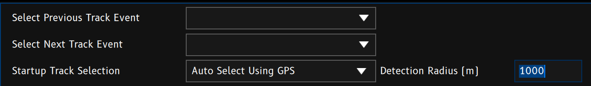
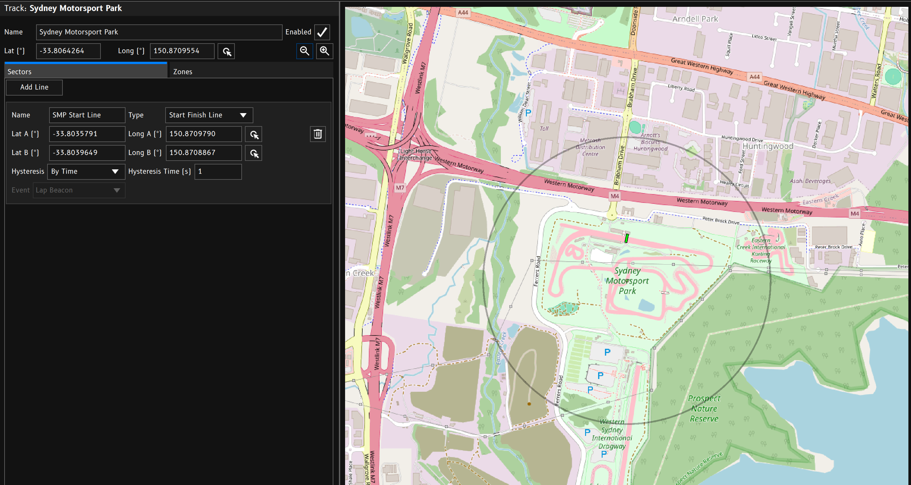
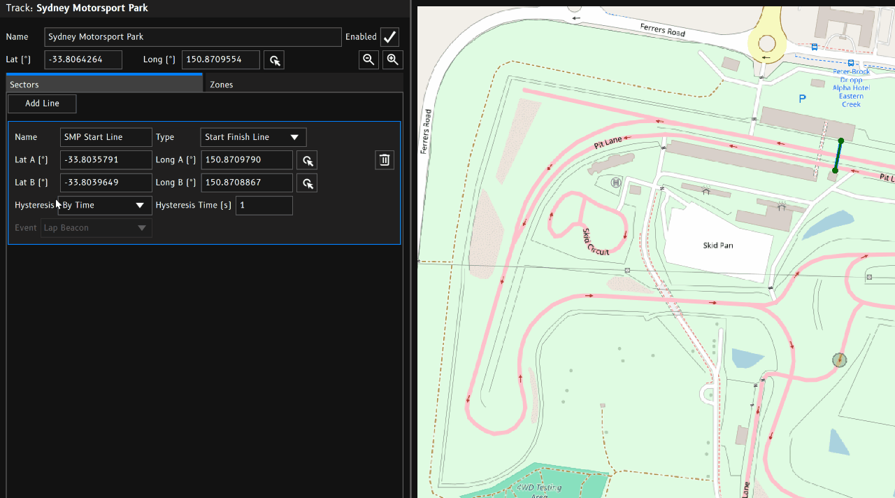
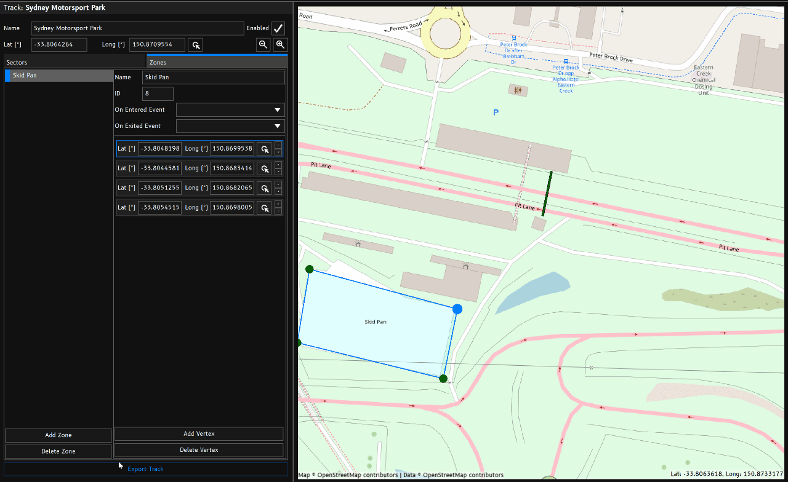
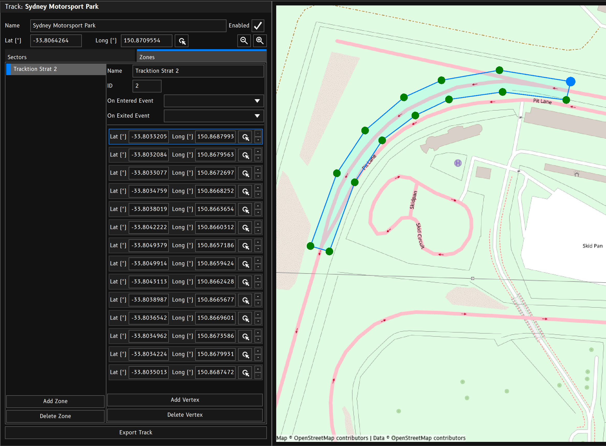

Track Setup determines how GPS based [Lap Timing](./lap-timing.md) functions.

Lap Timing and Track Setup are separated so that other systems can also generate the lap and sector beacons. This allows the use of other timing systems such as laser beacons.

## Location Detection

Each track has a central GPS position. This allows the device to select the track as the active track when it detects itself inside the detection radius of a particular track.
> **Note:** To use automatic track location detection, `Startup Track Selection` needs to be set to `Auto Select Using GPS`.

Alternatively, tracks can be selected manually by assigning events to the `Select Previous Track Event` and/or `Select Next Track Event` options.

## Tracks
Tracks are essentially a collection of GPS coordinates that allow the device to output sector and lap beacons as well as zone detection.

### Latitude / Longitude
The track's `Latitude` and `Longitude` values are used to set the position of the map window as well as automatic location detection.
To quickly adjust the position, click the `Pick Position` button and click the new postion in the map window.

### Enabled
When the track is `Enabled`, it is included in the automatic search for the current location. Disabled tracks will be ignored. This allows multiple versions of the same track to exist in the config without confusing the automatic location detection system. For example you may have different versions with different sector or zone setups.

{}Each tracks must always have a unique name.{}

### Zoom In / Out
The zoom in and zoom out buttons control the default zoom level of the track map view. The zoom level is stored in the config so unless the user pans or zooms the map with the mouse, the map will recentre on the tracks central GPS position and set zoom level.

## Sectors
Sectors are made up of two position coordinates to create an imaginary line. When the device detects that it has crossed this line, it can output an event.

 

**Predefined line types will output specific events:**
 - Start Finish Line → [Lap Beacon](#lap-beacon)
 - Start Line → [Lap Beacon](#lap-beacon)
 - Sector Line → [Sector Beacon](#sector-beacon)
 - Finish Line → [Finish Beacon](#finish-beacon)
 - Custom Line → *User Defined (any event)*

**To create a new sector line:**
 1. Click `Add Line`. 
 2. Update the line type and name as needed.
 3. Click the `Pick Position` button for Lat A / Long A.
 4. Click the position in the map window for the lines A position.
 5. Click the `Pick Position` button for Lat B / Long B.
 6. Click the position in the map window for the lines A position.
 7. If you've selected a `Custom Line` type, select the output event.

There are three important events used by the [Lap Timing](./lap-timing.md) function. Appropriate use of these beacon events will result in accurate lap timing data. Using the preset line types will handle outputting the correct event for you.

### Lap Beacon
When the `Lap Beacon` event is triggered, the [Lap Timing](./lap-timing.md) function will initiate the start of a new lap.

### Sector Beacon
When the `Sector Beacon` event is triggered, the [Lap Timing](./lap-timing.md) function will initiate the start of a new sector within the current lap.

### Finish Beacon
When the `Finish Beacon` event is triggered, the [Lap Timing](./lap-timing.md) function will end the current lap and wait for a new lap to start.
This is useful for point to point races or drag racing that do not have a common Start/Finish line.

## Zones
Zones are polygonal areas or regions within a track or location. 

### ID
You can give each zone an `ID` number. This number does not have to be unique. When the device detects that it is inside a particular zone, it will output the zones `ID` to value to the `Track Zone` channel. When not inside a zone, `Track Zone` will revert to a value of 0. You can assign the same ID to multiple zones accross multiple tracks.

**For example:**
If you wish to create a common pit speed limiter, you can draw a zone around the pit lane of multiple tracks and assign them a common `ID` number. Inside a conditional Logic function, you can check to see if the current `Track Zone` value is your designated Pit Lane `ID`. 
> You may with to add additional logic checks in the event the GPS fix is poor.

{}
 - Current GPS position is outside any zones: `Track Zone` = 0.
 - GPS position goes inside a zone with ID of 4: `Track Zone` = 4.
 - GPS position enteres a zone with ID 2: `Track Zone` = 2.
 - GPS position leaves the zone back to unzoned space: `Track Zone` = 0.
{}

### Enter and Exit Events
Optionally, the device can trigger [events](../concepts/channels-and-events.md#events) of your choosing when a zone is entered and/or exited.

### Vertices
A zone is made up of a collection of vertices.

{}Zone polygons require at least 3 vertices to be valid{}
 -
{}Zone polygons must not self intersect{}

