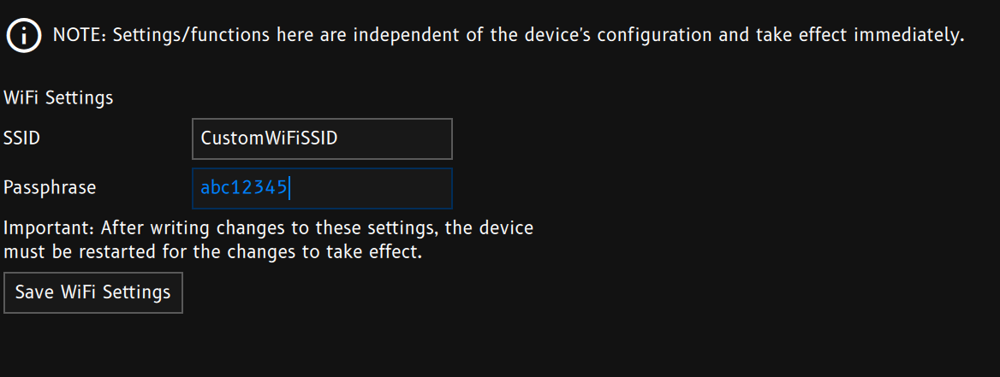

By default, the ED Series Displays will broadcast the following Wi-Fi networks.

## Default Network
| Model | SSID  | Passphrase |
| ----- | ----- | ---------- |
| ED10M | ED10M | ed10mwifi  |
| ED7M  | ED7M  | ed7mwifi   |
| ED7   | ED7   | ed7_wifi   |

## Settings
The user can change the `SSID` and `Passphrase` freely. 
> **Note:** This change is stored in the device, independent of the loaded config.

