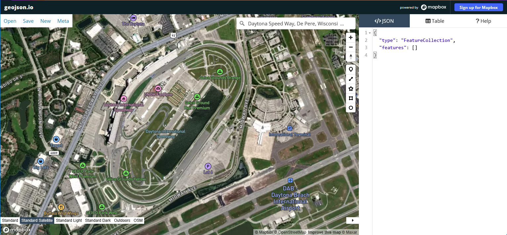
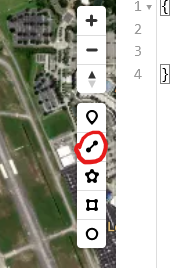
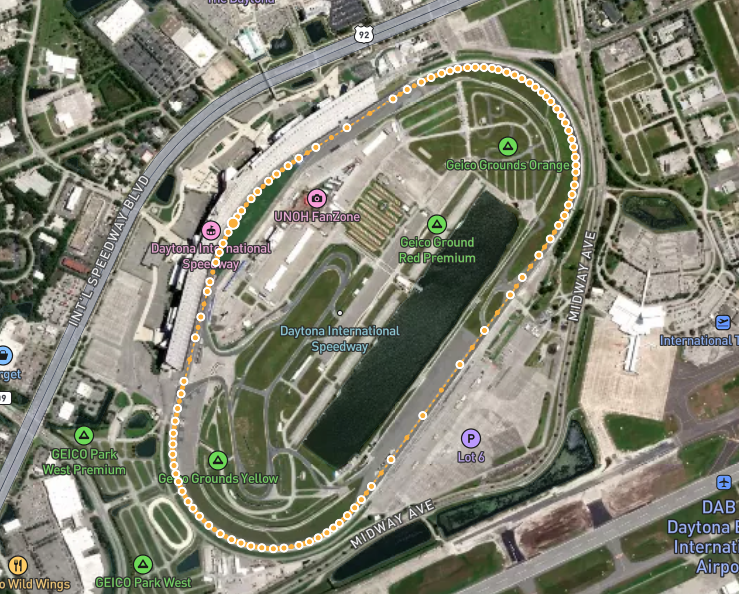
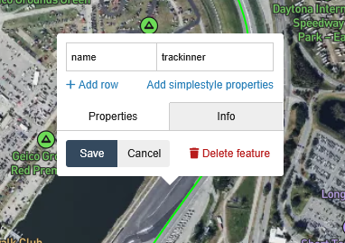
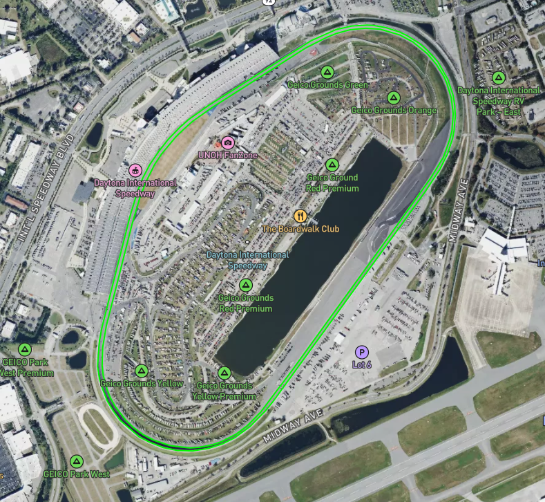
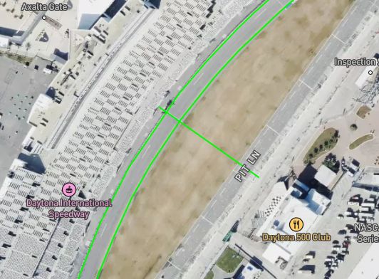

You can create your own track map files.

Track map files are formatted in a standardized geoJSON format. [Learn more about geoJSON](https://en.wikipedia.org/wiki/GeoJSON).

Track maps can be created using a variety of tools, but the one we will use here is [geojson.io](https://geojson.io/), which is a simple online geoJSON editor.

Once you have created your track map, you can submit it for inclusion in our database by emailing it to [support@emtronaustralia.com.au](mailto:support@emtronaustralia.com.au).

### Steps using geojson.io to create a track map

1. Open [geojson.io](https://geojson.io/) in your web browser.
2. Use the search bar to locate the area where the track is located.

In this example we will create a track map for Daytona International Speedway.

First we will create the track inner line.

Select the line tool:

Then use the crosshair to click at some point on the inner edge of the track, then continue clicking around the track in the normal direction of travel until you return to the starting point. Double click to finish the line.

It should look something like this:

Next we need to label the track inner by clicking the line:

Set the properties exactly as shown above, notice `trackinner` is one word, all lowercase.

Repeat the process for the track outer line.

When complete it should look something like this:

Set the properties for this line `name` to `trackouter`.

Finally install the start finish line and any sectors required. Important: the start and sector lines can only be made of a single straight line segment (e.g. two points).

The start finish line should have the name `start`, and sectors should be named `sector 1`, `sector 2`, etc.

The start line normally extends across the pit lane so laps are counted when traveling via the pit lane.

When complete it should look something like this:

So in this example we have three features (no sectors in this example):

| Property | Value      | Description                 |
|----------|------------|-----------------------------|
| name     | trackinner | The inner edge of the track |
| name     | trackouter | The outer edge of the track |
| name     | start      | The start/finish line       |

You can now export the geoJSON file by clicking the `Save` button in the top left corner, then selecting `GeoJSON`.

You can also edit our existing track files.

Here is the example track we created:

## Daytona International Speedway



