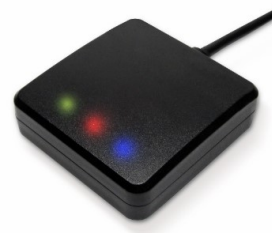

The Emtron EGPS-10 is a high-performance 10 Hz L1-band GNSS receiver designed for automotive navigation.

## Features
 - Supports GPS, GLONASS, GALILEO, BEIDOU and QZSS
 - Capable of SBAS (WAAS, EGNOS, MSAS, GAGAN) and QZSS SLAS
 - Fast Time-To-First-Fix (TTFF)
 - Hybrid ephemeris prediction for faster cold start
 - Waterproof

## Specifications
|                        |                       |
|------------------------|-----------------------|
| Update Rate            | 10 Hz                 |
| Channels               | 47                    |
| Aquasition Time (Hot)  | 1 second (typical)    |
| Aquasition Time (Cold) | 28 seconds (typical)  |
| Accuracy               | 1.5 m                 |
| Max Altitude           | 18000 m               |
| Max Velocity           | 500 m/s               |
| Communications         | RS232                 |
| Power Supply           | 4.75V - 5.25V         |
| Supply Current         | 31 ma                 |
| Operating Temperature  | -10°C - 60°C          |

## Wiring
{}**Mating Connector:** Deutsch DTM06-4S.{}

{}The EGPS-10 module requires a 5V power supply. Connecting to an unregulated supply will damage the device.{}

| Pin | Function |
| --- | ---------|
| 1   | GND      |
| 2   | RS232 Tx |
| 3   | RS232 Rx |
| 4   | +5V      | 

> **Note:** RS232 Tx should be wired to RS232 Rx on the receiving device and vice versa.