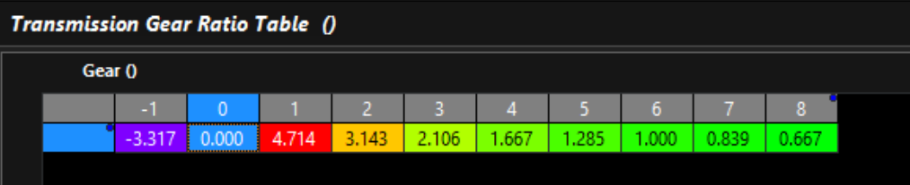

## Wiring
Read and follow the wiring information [here](./wiring/power-wiring.md). It's very important that the TCM is powered correctly.

---

## Mandatory Engine & Driver Inputs
The following inputs MUST be configured for normal transmission operation. Input's can be sourced from physical inputs or CAN data. 

>[!TIP] When used with an Emtron ECU, simply enable the Emtron Transmission Control Rx/Tx data streams.

For more info on Emtron ECU Integration, see [here](./tuning/emtron-ecu-integration.md).

### Engine Speed
Engine RPM from the engine ECU is required.

### Engine Torque
Torque data is used extensively by numerous sub systems and must be accurate. The ability of the TCM to control clutch pressures during a shift begins and ends with accurate input torque data.

Both of the following torque inputs are required:

**Engine Torque (Available)**: The amount of engine torque available if no reductions were in place.

**Engine Torque (Supplied)**: The amount of torque that is actually being supplied, inclusive of active reductions such as ignition retards and fuel or ignition cuts.

>[!INFO] Torque should be positive when the engine is accelerating and negative when the engine is decelerating (or being driven by the driveline).

### Pedal & Throttle Position
Pedal position represents the drivers intention and is more useful in most cases than throttle position, which is often manipulated by engine control sub systems.

In the case of a cable throttle (NOT RECOMMENDED), the Pedal Position input function will be OFF. Sub systems that require Pedal Position will fall back to looking for Throttle Position automatically. This excludes any table axes using Pedal Position, which will be required to be changed manually.

**Pedal Position**: Driver pedal position demand.

**Throttle Position**: Engine throttle position or throttle area demand.

### Brake Switch
A switch that shows ON when the brake is applied. This is used by systems such as Takeup and DCT Gear Pre-selection.

### Shift Control Inputs
A combination of inputs that allow the selection of drive modes and gears, such as:
 - Shifter Position
 - Up/Down shift switches
 - Drive mode request buttons or switches

For more info on drive modes see [here](./tuning/drive-modes.md).

---

## Additional Engine Inputs
The following inputs are recommended to improve the quality of transmission management:
 - Engine Idle Target Speed
 - Engine Idle Status (On/Off)
 - Overrun Fuel Cut Status (On/Off)
 - Engine Temperature

---

## Mandatory Transmission Inputs
These inputs vary based on the transmission in question but most transmissions will require:
 - Input Shaft Speed
 - Output Shaft Speed
 - Transmission Fluid Temperature 

Dual Clutch Transmissions will also require:
 - Clutch Speeds
 - Shift Fork Positions

--- 

## TCM to ECU Output Signals
At the bare minimum, the engine ECU needs to know when to reduce torque (cut) and when to rev-match (blip). Ideally the engine ECU should be listening to torque limit data so that during a shift (or any other time) the TCM is in control of the amount of torque supplied by the engine.

There are many runtime channels generated by the TCM that can be transmitted via CAN or output physically by User Functions driving output pins.

**Useful runtime channels include:**
 - **Gear**: The currently engaged gear.
 - **Next Gear**: Shows the gear that will be shifted into. When not shifting `Next Gear` will show the same as `Gear`.
 - **Previous Gear**: Shows the gear that is being shifted out of. When not shifting `Previous Gear` will show the same as `Gear`.
 - **Up Shift Request**: Normally Off (0). Transitions to On (1) for the entire duration of an up shift.
 - **Down Shift Request**: Normally Off (0). Transitions to On (1) for the entire duration of a down shift.
 - **Up Shift Torque Limit Status**: Normally Off (0). Transitions to On (1) while an up shift torque limit is in place.
 - **Up Shift Torque Limit**: When no limit is in place, this channel will hold the Torque Limit Off value as configured (Eg: 6000nm). During an up shift torque limit, it will show the final torque limit value as requested by the TCM.
 - **Down Shift Rev Match Status**: Normally Off (0). Transitions to On (1) while a down shift rev match is being requested.
 - **Rev Match Target**: Normally 0 RPM. During a rev-match request the desired target RPM is shown.
 - **Rev Match Torque**: Normally 0 NM. During a down shift rev-match request the TCM will calculate the unloaded engine torque required to lift the engine speed to the rev-match target.

 ---

## Ethernet Connection
Once powered up, connect the TCM's [ethernet](./wiring/ethernet-wiring.md) to your PC's ethernet port (or USB ethernet adapter). There's no need to set a static IP address. If you're ethernet adapter is already setup for an Emtron ECU's static IP, it can stay unchanged.

The initial connection will take about 5-10 seconds to establish. When the TCM is detected, TMtune will show the available devices panel.


---

## Firmware
The latest TCM firmware is included with TMtune. Once detected you can select the TCM and click the `Update Firmware` button. 

The firmware update window shows the current device firmware and lists the version available to upload (usually there will only be one). Unless the current firmware version is older than the latest version, there's no need to update.


>[!INFO] The update takes about 30 seconds to complete.

---
## Transmission Specific Information
Read any documentation for your transmission if available. This list will grow over time as we develop more application specific base calibrations.

[Transmission Documentation](./transmissions/_index.md)

---

## Base Cal File
If you are using a transmission with a base cal file available, now is the time to upload the latest base cal file. The files are included with TMtune. You can either upload the file from the welcome screen or you can open the device and upload a file from the File menu.

> By default, base cal files are located in `Documents\Emtron\TMtune\Cal Files`

---

## Gear Ratios
Even if you're using a base provided base calibration, it's worth double checking the gear ratios are correct as many ratio options may exist for a given transmission.


The correct gear ratios must also be entered into the ECU.



The TCM generates two gear ratio runtimes:
 - **Gear Ratio**: the output from the gear ratio table
 - **Input/Output Shaft Speed Ratio**: Input shaft speed / Output Shaft Speed.

These two values should be the same when in a driving gear. This is particularly useful for validating the input and output shaft speed sensors and that you are in the gear you think you are.

---

## CAN
Ensure communications with the engine ECU are working. Follow the [Emtron ECU Integration Guide](./tuning/emtron-ecu-integration.md) to set up the ECU.

>[!IMPORTANT] Remember to set the CAN bus termination resistor(s) on or off as required for you bus topology.

To quickly validate the state of the CAN bus, Goto the CAN tab in the F3 Runtimes window and ensure there are no errors and that the active channel counters are showing activity.


---

## Validating I/O
Open the device and inspect a few key the live data channels.

Press F3 to open the **Runtimes window**:
 - On the TCM Internal tab, ensure that **ALL** the power supply inputs are at battery voltage. Any that aren't must be rectified or the TCM outputs will not work.

 - Use the Analog Inputs and Digital Inputs tabs to validate the state of the raw inputs. Test that the raw inputs of switches and sensors are working as expected.

### Testing Solenoids
From the Config tree, navigate to **Output Config > Output Pins**. From there you can place each output into a test mode to validate it's physical connection.

By putting the output into `Test - Current Control` mode you can command the solenoid to a desired current and check the result with the F3 Runtimes window on the Outputs tab. 

The actual current draw of the solenoid should very closely match the target, as long as the solenoid isn't saturated. 
 - A solenoid that saturates at 0.5A will never draw more than that.
 - Most variable force transmission solenoids will be able to draw 1.0-1.5A.
 - Smaller on/off type solenoids will typically be well under 1.0A.  


>[!TIP] 
>If a solenoid doesn't draw any current while being commanded to do so in test mode, it's probably an open circuit.

### Input Sources
Under **Input Config**, ensure all relevant inputs are assigned to the correct source that matches the wiring and/or CAN configuration. This is particularly important if you've wired something different how the base cal file you're using.


### Output Assignment
Under **Output Config**, ensure all relevant outputs are assigned to match your wiring.


---

## Torque
Ensure that the received engine torque data is valid and realistic.
Use the following criteria to validate the torque input...

With the engine unloaded in Neutral:
 - Engine speed stable: Torque should be zero.
 - Engine accelerating: Torque should be positive.
 - Engine decelerating: Torque should be negative.

Torque figures should be verified against dyno figures. Remember that the torque given to the TCM will be flywheel torque, where-as on a chassis dyno, the figures will be wheel torque after drivetrain losses. For this reason it's expected that the TCM's input torque should always be higher than the dyno figures by some realistic margin to account for drivetrain losses.

### Engine Inertia
A sensible value for engine inertia ensures that shifts synchronize well, with less reliance on closed loop control.

Under **Vehicle Setup > Vehicle Setup** enter an inertia value for the engine.
You can also use the Engine Inertia Test mode to help find a useable value.

>[!IMPORTANT]
>**Engine Inertia Test** relies on accurate engine torque data to work.

### Torque Limits
The most critical torque limit is the Up Shift Torque Limit. Now is a good time to make sure it has sensible values in it.

Navigate to **Shift Setup > Up Shift > Up Shift Torque Limit**.


For more info of how torque reductions are applied, see [here](./tuning/multi-clutch-shifting.md#torque-reductions).

### ECU Torque Control
Emtron ECU's will abide by torque limits set by the TCM with very little tuning burden on the end user.

#### Frictional Loss
Torque is calculated by the ECU based on air mass. As long as the fuel system model is accurate the torque model will usually be very accurate. The user needs to focus primarily on validating[Frictional Loss](../articles/frictional-loss.md).

When a torque reduction is requested, the ECU will use a combination of ignition retard and cut to achieve it.

#### Ignition Retard Scaling
The amount of retard used is calculated using the **Torque Limit Ignition Retard Scaling Table**.
This table allows the ECU to lookup the amount of retard rquired for a given percentage of torque reduction, as well as how much torque will be reduced from a given retard value.
**Example:**
```
Engine Torque (Available) = 500 Nm
Torque Limit = 300 Nm
Torque Reduction = 500 - 200 = 200 Nm
Toque Reduction % = (200 / 500) * 100 = 40%
Ignition Retard = Table Value @ 40% = 24 degrees.
```


The Torque Limit Ignition Retard Scaling Table can be validated on the dyno by testing the torque reduction for a given global ignition trim. We have found that the above table is very useable for a wide range of applications without manual validation.

#### Cut Scaling
Similar to the ignition retard scaling, the amount of cut required for a given torque reduction is controlled by the **Torque Limit Cut Gain Table**. 
A value of 1.00 in this table tells the ECU that for a 50% torque reduction, it needs a 50% cut.


#### TM16 Engine Cut Setup
The TM16 will transmit a Fast and Slow torque limit value to the ECU. The Fast limit is used during shifts, the Slow limit is used during sustained torque limit such as the Global Torque Limit.
The ECU interprets the Fast Limit as a retard based limit, and the Slow limit as a throttle based limit.
In the TM16 Menu, you can control how the ECU converts the retard based fast limit into a cut with the **TCM Torque Limit Engine Cut threshold**. The lower this value is, the more cutting will be used to meet the torque limit.


---

## Touch Points

>[!IMPORTANT] 
>On every new install, you must find the clutch touch points. 

The procedure for doing so is [here](./tuning/clutch-touch-points.md).

---

## Tuning
It's common for tuners to be managing tuning the engine at the same time as the transmission. Once all the critical systems have been validated and all gears are confirmed working, you should be able to focus on the engine to get the ECU's torque model validated.

Once you have confidence in the torque figures in the TCM, you can validate that the transmission operates correctly under load. How this looks will vary a lot depending on the transmission config. 

Familiarize yourself with [Multi-Clutch Shift Phases](./tuning/multi-clutch-shifting.md). 

**At this stage you should be able to:**
 - Engage all forward and reverse gears.
 - Apply high torque in gear without any clutch slip.
 - Change gear without excessive flaring or harshness.

---

## Trouble Shooting
#### Clutch slip in gear
 - Check the torque input is not too low.
 - Line pressure is not too low.
 - Clutch and line pressure solenoids are tracking their current targets.

#### Flaring on shifts
 - Check the torque input is not too low.
 - Check the [Clutch Modelling](./tuning/clutch-model.md)
 - Check the [Clutch Touch Points](./tuning/clutch-touch-points.md)
 - If applicable, make sure a valid [Clutch Gear Load Factor Table](./tuning/clutch-model.md#clutch-gear-load-factor) is in use.
 - Line pressure is high enough to support the clutch pressure.
 - Clutch and line pressure solenoids are tracking their current targets.
 - Torque reductions are being acted on by the Engine ECU.
