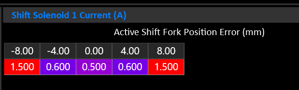

## Wiring
The OEM Mechatronic unit must be removed so that the transmission can be run directly by the TCM. 

>[!INFO] The example below uses the DomiWorks Install Board.
>  The pullup resistors supplied on the board **should be removed** as pullup control is available on all TCM inputs.

### Pad Group A
| OEM Pad | Function | TCM Pin |
| ------- | -------- | ------- |
| PA1     | SGND     | SGND |
| PA2     | Clutch A Pressure | An 3 |
| PA3     | +5V      | 5V Out 1 |

### Pad Group B
| OEM Pad | Function | TCM Pin |
| ------- | -------- | ------- |
| PB1     | SGND     | SGND |
| PB2     | Clutch B Pressure | An 1 |
| PB3     | +5V      | 5V Out 1 |

### Pad Group C
| OEM Pad | Function | TCM Pin |
| ------- | -------- | ------- |
| PC1     |          |   |
| PC2     | Clutch A Speed | Hall 1 |
| PC3     | Clutch B Speed | Hall 2 |
| PC4     | Fork 4/6 Position | An 2 |
| PC5     | SGND     | SGND |
| PC6     | Fork 5/7 Position | An 4 |
| PC7     | +5V      | 5V Out 1 |
| PC8     | Clutch A Temp ? | An 5 |
| PC9     | +5V      | 5V Out 1 |
| PC10    | Clutch B Temp | 5B Out 1 |
| PC11    | Fork 2/R Position | An 8 |
| PC12    | Fork 1/3 Position | An 7 |
| PC13    | +5V      | 5V Out 1 |

### Pad Group D
| OEM Pad | Function | TCM Pin |
| ------- | -------- | ------- |
| PD1     | Shift Solenoid 1 | Sol 13 |
| PD2     | Solenoid +12V | Sol +V Out (B33) |
| PD3     | Shift Solenoid 2 | Sol 14 |
| PD4     | Solenoid +12V | Sol  +V Out (B33) |
| PD5     | Shift Solenoid 3 | Sol 15 |
| PD6     | Solenoid +12V | Sol +V Out (B33) |
| PD7     | Shift Solenoid 4 | Sol 16 |
| PD8     | Solenoid +12V | Sol +V Out (B33) |

### Pad Group E
| OEM Pad | Function | TCM Pin |
| ------- | -------- | ------- |
| PE1     |          |   |
| PE2     |          |   |
| PE3     | SGND     | SGND |
| PE4     |          |   |
| PE5     |          |   |
| PE6     | Trans Fluid Temp | An 9  |
| PE7     | Input Shaft Speed | Hall 3 |
| PE8     |          |   |
| PE9     |          |   |
| PE10    |          |   |
| PE12    |          |   |
| PE13    |          |   |
| PE14    |          |   |
| PE15    |          |   |

### Pad Group F
| OEM Pad | Function | TCM Pin |
| ------- | -------- | ------- |
| PF1     | Axis A Safety | Sol 2 |
| PF2     | Solenoid + 12V | Sol +V Out (B30) |
| PF3     | Clutch A | Sol Pair 1 & 4 |
| PF4     | Solenoid + 12V | Sol +V Out (B30) |
| PF5     | Axis B Safety | Sol 6 |
| PF6     | Solenoid + 12V | Sol +V Out (B30) |
| PF7     | Clutch B | Sol Pair 5 & 8 |
| PF8     | Solenoid + 12V | Sol +V Out (B30) |
| PF9     | Line Pressure Solenoid | Sol 9 |
| PF10    | Solenoid + 12V | Sol +V Out (B30) |
| PF11    | Cooling Flow Solenoid | Sol 10 |
| PF12    | Solenoid + 12V | Sol +V Out (B30) |

---

## Gear Ratios
### Short Ratio
| Gear | Ratio  |
| ---- | ------ |
| R	   | -3.667 |
| 1st  | 4.780  |
| 2nd  | 2.933  |
| 3rd  | 2.153  |
| 4th  | 1.678  |
| 5th  | 1.390  |
| 6th  | 1.203  |
| 7th  | 1.000  |

---

## Clutch Geometry
| Clutch    | Plates (S/D) | Friction ID/OD (mm) | Piston ID/OD (mm) |
| --------  | :----------: | :-----------------: | :---------------: |
| Clutch A  | 2(S) + 4(D)  | 190.0 / 218.0       | 190.0 / 208.0 *   |
| Clutch B  | 2(S) + 4(D)  | 121.5 / 162.0       | 96.0 / 140.0 *    |

> \* Piston diameters are close approximations only

>[!NOTE]
>Our test vehicle was a track car with unknown clutch condition. We settled on a Estimated Clutch Efficiency factor of 65% but can't say for certain if this is correct for all installations.

---

## Shift Forks
The GS7 has 4 shift forks controlled by 4 Shift Solenoids. Operation is fairly simple, with a binary combination of solenoids resulting in a different movement operation. 

Manipulating the current through the shift solenoid allows the fork movement to be slowed as it approaches the target.

## Selector Forks
| Fork | Gear Low | Gear High |
| ---- | -------- | --------- |
| 1    | 4        | 6         |
| 2    | 2        | R         |
| 3    | 1        | 3         |
| 4    | 5        | 7         |
>[!IMPORTANT] Reverse and 2nd are on different clutches. 
>Fork 2 must be assigned to Axis A & B to inform the system that this is not a config mistake.

### Gear to Fork Mapping
The following table shows the nominal fork mapping. Actual positions should be fine tuned with real world measurements see during operation.

| Gear | Fork  | Position | Volts |
| ---- | ----- | -------- | ----- |
| R    | 2-H   | 8.0mm    | 3.830 |
| N    | *ALL* | 0.0mm    | 2.500 |
| 1    | 3-L   | -8.0mm   | 1.360 |
| 2    | 2-H   | -8.0mm   | 1.360 |
| 3    | 3-H   | 8.0mm    | 3.830 |
| 4    | 1-L   | 8.0mm    | 3.830 |
| 5    | 3-H   | 8.0mm    | 1.360 |
| 6    | 1-H   | -8.0mm   | 1.360 |

--- 

## Shift Solenoids
| Solenoid | Function          |
| -------- | ----------------- |
| 1        | Fork Move +/-     |
| 2        | Fork Move +/-     |
| 3        | Fork Select B0    |
| 4        | Fork Select B1    |

### Shift Solenoid Truth Table
| Fork        | Gear | Sol 1 | Sol 2 | Sol 3 | Sol 4 |
| ----------- | ---- |:-----:|:-----:|:-----:|:-----:|
| **1 (4/6)** | 4 << | X     |       | X     |       |
| **1 (4/6)** | >> 6 |       | X     | X     |       |
| **2 (2/R)** | R << |       | X     |       |       |
| **2 (2/R)** | >> 2 | X     |       |       |       |
| **3 (1/3)** | 1 << | X     |       |       | X     |
| **3 (1/3)** | >> 3 |       | X     |       | X     |
| **4 (5/7)** | 5 << | X     |       | X     | X     |
| **4 (5/7)** | >> 7 |       | X     | X     | X     |

